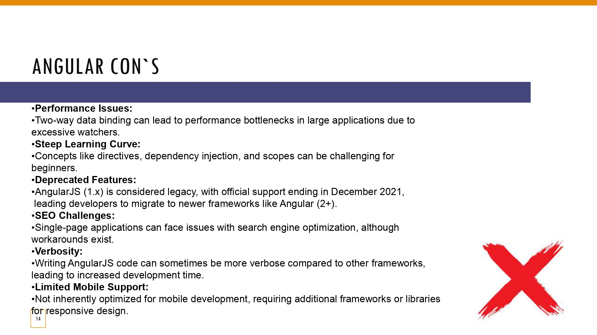

# AngularJS Research - Group E

## References
- [What is AngularJS?](#what-is-angularjs)
- [MVC Architecture](#mvc-architecture)
- [AngularJS Directives](#angularjs-directives)
- [Dependency Injection](#dependency-injection)
- [Routing](#routing)
- [Angular Expressions](#angular-expressions)
- [Angular DOM Directive](#angular-dom-directive)
- [Angular Form Validation](#angular-form-validation)
- [Data Binding](#data-binding)
- [Ternary Operator in Angular](#ternary-operator-in-angular)
- [Angular Integration with Backend](#angular-integration-with-backend)
- [Angular Pros](#angular-pros)
- [Angular Cons](#angular-cons)
- [Companies Using AngularJS](#companies-using-angularjs)
- [Popularity of AngularJS](#popularity-of-angularjs)
- [Tutorial on AngularJS](#tutorial-on-angularjs)
- [Introduction to AngularJS](#introduction-to-angularjs)
- [Learning Objectives](#learning-objectives)
- [Prerequisites](#prerequisites)
- [MVC Architecture](#mvc-architecture)
- [Setting Up the Development Environment](#setting-up-the-development-environment)
- [Two-Way Data Binding](#two-way-data-binding)
- [Directives](#directives)
- [Expressions](#expressions)
- [Modules](#modules)
- [Controllers](#controllers)
- [Filters](#filters)
- [Views and Routing](#views-and-routing)
- [Form Validation](#form-validation)
- [Building the Quiz Application](#building-the-quiz-application)
- [Conclusion](#conclusion)
- [Source Code](#source-code)

---

## Presentation of Angular


## What is AngularJS?


AngularJS is a popular framework developed by Google, designed to create dynamic, single-page applications (SPAs). It’s open-source, which means it’s free to use and continuously updated by the community. AngularJS allows developers to build applications that load a single HTML page and update the content dynamically as users interact, without reloading the whole page. This makes the user experience faster and more seamless.

One of the key features is that AngularJS is component-based, meaning that the application is divided into reusable components, making development more organized and maintainable. Another important aspect is that AngularJS uses TypeScript, a superset of JavaScript that enhances the language with features like type checking, which leads to fewer bugs and more robust applications.

AngularJS is not just for small projects—it’s enterprise-level, used by large-scale applications for its scalability and high performance.

## MVC Architecture


Angular uses the Model-View-Controller (MVC) architecture to organize and separate different parts of an application, making it more structured and easier to maintain.

- **Model**: This represents the data and business logic. In Angular, services handle the model by retrieving and managing data, often using APIs to communicate with a backend.
- **View**: The user interface, defined by HTML templates and styled with CSS. The view interacts with the model through two-way data binding, allowing for real-time dynamic updates in the UI whenever the underlying data changes.
- **Controller**: In Angular, the controller role is managed by components. These components handle user interactions, update the model or the view accordingly, and control how data flows between the two.

## AngularJS Directives


Angular has three main types of directives:

- **Component Directives**: Custom elements that define a section of the user interface (UI). They use templates, styles, and logic to create reusable views (e.g., `<app-header></app-header>`).
- **Structural Directives**: These modify the structure of the DOM by adding or removing elements (e.g., `*ngIf`, `*ngFor`).
- **Attribute Directives**: These modify the behavior or appearance of an existing element without altering the DOM structure (e.g., `ngClass`, `ngStyle`).

## Dependency Injection


In Angular, Dependency Injection (DI) is a design pattern that provides components with their required dependencies, such as services, instead of having the components create these dependencies themselves. This approach enhances the modularity, testability, and maintainability of the code.

When a component or service requires a dependency, Angular's DI system automatically finds the needed instance in the injector and provides it. This makes the process of managing dependencies easier and reduces code duplication across the application.

## Routing


In Angular, routing enables navigation between different pages or views in a single-page application (SPA) without reloading the entire page.

- **Route Configuration**: The `$routeProvider` is used to define different routes within the application.
  - `/ (Home route)`: This is the default route, which loads the `home.htm` template when the URL is `/`.
  - `/registration`: This route loads the `registration.htm` template when the URL is `/registration`.
  - `/login`: This route loads the `login.htm` template when the URL is `/login`.
- **Navigation Links**: The `<a>` elements in the HTML use `href="#/path"` to link to different routes.
  - `href="#!/"`: Navigates to the home page.
  - `href="#!/registration"`: Navigates to the registration page.
  - `href="#!/login"`: Navigates to the login page.
- **ng-view**: The `<div ng-view></div>` acts as a placeholder where the content of the routed templates (e.g., `home.htm`, `registration.htm`, `login.htm`) will be dynamically loaded based on the current route the user navigates to.

This setup allows AngularJS to load different templates dynamically, ensuring that the page does not reload while switching between views, providing a smooth user experience in SPAs.

## Angular Expressions


Angular expressions are used to bind dynamic data from the component to the view. They allow you to display variables, perform simple calculations, or manipulate data directly within the HTML. Unlike JavaScript, Angular expressions are designed to be simple, without supporting loops or conditionals, and they don’t produce side effects. Their primary role is to make the view responsive by dynamically rendering data and values from the component in a lightweight and efficient way.

## Angular DOM Directive


The `ng-show` directive in AngularJS is used to conditionally display or hide an element based on a boolean expression. When the expression evaluates to `true`, the element is visible, and when it is `false`, the element is hidden but still remains in the DOM.

## Angular Form Validation


In AngularJS, form validation is automatically handled when input fields are given specific types, such as "email". The validity of the input is tracked using the built-in `$valid` property. When an invalid email (like "kaszapnagyp") is entered, AngularJS marks the input as invalid, and `$valid` becomes `false`. When a valid email (like "szapnagyp@gmail.com") is entered, the `$valid` property becomes `true`, indicating the input is correct.

## Data Binding


Data binding in AngularJS can occur in two ways:

- **One-way data binding**: Data flows in a single direction, either from the component (model) to the view or from the view to the component. It requires an event to trigger data flow.
- **Two-way data binding**: Data flows in both directions. Changes in the view (e.g., typing in an input field) are automatically reflected in the component, and changes in the component are reflected in the view.

## Ternary Operator in Angular


The ternary operator in AngularJS allows conditional rendering based on a true/false condition. For example, checking if a user is logged in (`isLoggedIn`). If true, a welcome message like "Welcome, Peter Kaszap-Nagy!" is displayed along with a "Logout" button; if false, the user is prompted to log in.

## Angular Integration with Backend


Angular integrates with the backend using HTTP requests to retrieve or send data. Angular uses the `$http` service to send a GET request to a server endpoint, and the data returned from the server is stored and displayed in the view.

## Angular Pros


- **Two-Way Data Binding**: Simplifies the synchronization between the model and the view, reducing boilerplate code.
- **MVC Architecture**: Separates concerns, making the application more organized and maintainable.
- **Directives**: Enable the creation of reusable components and extend HTML's functionality.
- **Dependency Injection**: Facilitates better modularity and easier testing by managing dependencies efficiently.
- **Community and Support**: Angular has extensive documentation, tutorials, and a large community for support and resources.
- **Integration Capabilities**: Easily integrates with other libraries and frameworks.

## Angular Cons


- **Performance Issues**: Two-way data binding can lead to performance bottlenecks in large applications.
- **Steep Learning Curve**: Concepts like directives and dependency injection can be challenging for beginners.
- **Deprecated Features**: AngularJS (1.x) is considered legacy, with official support ending in December 2021.
- **SEO Challenges**: Single-page applications can face search engine optimization issues.
- **Verbosity**: Writing AngularJS code can be more verbose, leading to increased development time.
- **Limited Mobile Support**: AngularJS is not inherently optimized for mobile development.

## Companies Using AngularJS


Major companies like Google, Microsoft, PayPal, Upwork, Forbes, IBM, and The Guardian use AngularJS for building their applications due to its flexibility and scalability.

## Popularity of AngularJS


According to Stack Overflow's data from 2023, AngularJS remains one of the most popular frameworks despite the emergence of newer technologies like React and Vue.js. AngularJS continues to maintain a strong presence in the developer community.

## Thank You


Group E Presentation: 
- Aaron McAvoy
- Douglas McGregor
- Peter Kaszap-Nagy
- Balint Kaszap-Nagy

---

  # Tutorial on AngularJS

In this document, I'm gonna talk a little bit about what AngularJS actually is, why we use it, and what you're gonna be learning.

## Introduction to AngularJS

AngularJS is an **MVC-style JavaScript framework** for creating **single-page, data-driven applications**. **MVC** stands for **Model-View-Controller**, a design pattern that separates our data logic from our HTML output, making things easier as we develop our application.

Since AngularJS is a framework, we need to structure our code according to its requirements. Its features include:

- **Two-Way Data Binding**
- **Robust Templating System**
- **Seamless DOM Interaction**
- **Filters for Data Display Adjustments**
- **Directives that Expand HTML Functionality**

## Learning Objectives

In this tutorial, I'm going to cover the following topics:

- Understanding MVC in the context of AngularJS.
- Exploring two-way data binding and how it works.
- Diving into filters, directives, and expressions.
- Learning about controllers and how they help us manage data.
- Setting up routes and views to create a single-page application.
- Implementing form validation with AngularJS.
- Building a quiz app from scratch to put it all into practice.

## Prerequisites

Here's what you're going to need to know beforehand:

- **JavaScript**
- **HTML**
- **CSS** (Optional but advised)
- **JSON** (Optional but advised)

## MVC Architecture

AngularJS uses the **MVC architecture** to build web applications by dividing them into three main components:

### Model

Think of the model as data. For instance:

- JSON data
- Data from databases
- Data from external services (APIs)

### View

Used to display content and data to a user in a browser. Use expressions to insert data into views:


`<!-- Example of inserting data into a view -->`

>\<p>\{\{ data \}\}</p>


### Controller

Controllers handle the interaction between models and views, responding to actions and updating views with model data. They're the bridge that connects everything, ensuring smooth data flow.

We can have different controllers for different parts of our application, like a registration controller for signing up users or a contact controller to process contact form data.

**Example**

Suppose a user submits a contact form. The controller detects the form submission, retrieves the input data (like name and email) from the model, and processes it. Then, it updates the view to show a "Thank you" message. While the user only sees the final message, the controller handles everything behind the scenes, managing data flow between the model and view.

## Setting Up the Development Environment

In this section, I'm going to show you how to set up our development environment. You do not have to follow along at this stage if you do not want to, as we will start building the project from the **Building the Quiz Application section**, but it is advisable.

### Including AngularJS via CDN

Instead of downloading AngularJS and dealing with local files, we can include it directly using a Content Delivery Network (CDN).

1.  Include AngularJS in Your HTML

    Open your index.html file. In the <head> section, add the following script tag:

    ```Javascript
    <script src="https://ajax.googleapis.com/ajax/libs/angularjs/1.8.2/angular.min.js"></script>
    ```

    Your index.html should look like this:

    ```HTML
    <!DOCTYPE html>
    <html ng-app>
    <head>
    <meta charset="UTF-8">
    <title>Your AngularJS App</title>
    <script src="https://ajax.googleapis.com/ajax/libs/angularjs/1.8.2/angular.min.js"></script>
    </head>
    <body>
    <!-- Your content goes here -->
    </body>
    </html>
    ```

    Notes:

    - **_ng-app_**: This attribute initializes your AngularJS application. Placing it in the `<html>` tag tells AngularJS that the entire page is part of the app.
    - **_ Script in `<head>`_**: Unlike other scripts that you might place at the end of the `<body>`, AngularJS should be included in the `<head>` because it needs to load before the content to properly set up the templating and data binding.

2.  Include Additional Modules

    We'll add the AngularJS routing module to our application because we will be using it.

    Add the following script tag right after the main AngularJS script in your `<head>` section:

    ```Javascript
    <script src="https://ajax.googleapis.com/ajax/libs/angularjs/1.8.2/angular-route.min.js"></script>
    ```

    Now your index.html file should look like this:

    ```HTML
    <!DOCTYPE html>
    <html ng-app>
    <head>
    <meta charset="UTF-8">
    <title>Your AngularJS App</title>
    <script src="https://ajax.googleapis.com/ajax/libs/angularjs/1.8.2/angular.min.js"></script>
    <script src="https://ajax.googleapis.com/ajax/libs/angularjs/1.8.2/angular-route.min.js"></script>
    </head>
    <body>
    <!-- Your content goes here -->
    </body>
    </html>
    ```

## Two-Way Data Binding

Two-way data binding is one of the coolest features in AngularJS.

For More Details [AngularJS Data Binding](https://docs.angularjs.org/guide/databinding)

1. Add the following code between the `<body>` tags:

   > \<h1>Two-Way Data Binding Example\</h1>  
   > \<input type="text" ng-model="car" placeholder="Enter your favorite car">  
   > \<p>Your favorite car is: \{\{ car \}\}</p>  

   - **_ng-model:_** The `ng-model` directive binds the input field to a model (data variable). So, whatever you type into the input field is stored in the `car` variable.

   - **_Expressions:_** We are using double curly braces `\{\{ \}\}` to display the value of `car` in real time.

   Completed code:

   > \<!DOCTYPE html>  
   > \<html ng-app>  
   > \<head>  
   > \<meta charset="UTF-8">  
   > \<title>Your AngularJS App\</title>  
   > \<script src="https://ajax.googleapis.com/ajax/libs/angularjs/1.8.2/angular.min.js">\</script>  
   > \<script src="https://ajax.googleapis.com/ajax/libs/angularjs/1.8.2/angular-route.min.js">\</script>  
   > \</head>  
   > \<body>  
   > \<h1>Two-Way Data Binding Example\</h1>  
   > \<input type="text" ng-model="car" placeholder="Enter your favorite car">  
   > \<p>Your favorite car is: \{\{ car \}\}</p>  
   > \</body>  
   > \</html>  


Now, as you type into the input field, the paragraph below it updates automatically to show your input. This is called two-way data binding.

It's an efficient way to avoid writing additional JavaScript code.

## Directives

Directives are a fundamental part of AngularJS that let you extend the functionality of HTML. They tell AngularJS to perform specific behaviors on elements in your application. We have already used two directives in the previous section.

For More Details: [AngularJS Directives](https://docs.angularjs.org/guide/directive)

**Common Directives**

- **_ng-app_**

  Tells AngularJS that everything inside the `<html> `tags is part of the Angular application.

  Reference: [ngApp Directive](https://docs.angularjs.org/guide/directive)

- **_ng-model_**

  Binds input fields to models, allowing for two-way data binding.

  Reference: [ngModel Directive](https://docs.angularjs.org/api/ng/directive/ngModel)

- **_ng-repeat_**

  Repeats a set of HTML elements for each item in a collection.

  Reference: [ ngRepeat Directive](https://docs.angularjs.org/api/ng/directive/ngRepeat)

  ```HTML
  <ul>
  <li ng-repeat="car in cars">{{ car }}</li>
  </ul>
  ```

- **_ng-include_**

  Includes an external HTML fragment (partial) into your main file.

  Reference: [ngInclude Directive](https://docs.angularjs.org/api/ng/directive/ngInclude)

  ```HTML
  <!-- Main HTML file -->
  <div ng-include="'header.html'"></div>
  ```

  ```HTML
  <!-- header.html -->
  <header>
  <h1>My Application</h1>
  <!-- Navigation links -->
  </header>
  ```

- **_ng-show_**

  Displays an element when the expression evaluates to true.

  Reference: [ngShow Directive](https://docs.angularjs.org/api/ng/directive/ngShow)

  ```HTML
  <div ng-show="isLoggedIn">
  <p>Welcome back, user!</p>
  </div>
  ```

- **_ng-hide_**

  Hides an element when the expression evaluates to true.

  Reference: [ngHide Directive](https://docs.angularjs.org/api/ng/directive/ngHide)

  ```HTML
  <div ng-show="isLoggedIn">
  <p>Welcome back, user!</p>
  </div>
  ```

- **_ng-click_**

  Executes code when an element is clicked.

  Reference: [ngClick Directive](https://docs.angularjs.org/api/ng/directive/ngClick)

  ```HTML
  <button ng-click="count = count + 1">Click me!</button>
  ```

- **_ng-submit_**

  Binds AngularJS functions to the submit event of a form.

  Reference: [ngSubmit Directive](https://docs.angularjs.org/api/ng/directive/ngSubmit)

  ```HTML
  <form ng-submit="addItem()">
  <input type="text" ng-model="newItem" placeholder="Add item" required>
  <button type="submit">Add</button>
  </form>
  ```

- **_ng-srct_**

  Ensures the correct image source is set after AngularJS has evaluated the expression, preventing errors.

  Reference: [ngSrc Directive](https://docs.angularjs.org/api/ng/directive/ngSrc)

  ```HTML
  
  ```

Directives can be used in different forms, not just as attributes. While we've seen them as attributes so far, they can also be custom HTML elements.

## Expressions

Expressions in AngularJS are like little snippets of JavaScript code that you can place in your HTML to display dynamic data. They're usually enclosed within double curly braces {{ }}.

For More Details [AngularJS Expressions](https://docs.angularjs.org/guide/expression)

**Basic Usage**

- You can perform calculations directly in your HTML:

  ```HTML
  <p>{{ 5 * 5 }}</p>
  ```

- You can also concatenate strings:

  ```HTML
  <p>{{ 'Hello, ' + 'Peter!' }}</p>
  ```

**Using Variables**

- Let's initialize some data using the ng-init directive (in real applications, you'd use controllers, but we'll use ng-init for simplicity):

  ```HTML
  <body ng-app ng-init="numbers=[1,2,3,4,5]; cars=['Mercedes','BMW','Audi']">
  ```

  Now you can access this data in your expressions.

- Access array elements:

  ```HTML
  <p>First number: {{ numbers[0] }}</p> <!-- Outputs 1 -->
  ```

- Perform operations:

  ```HTML
  <p>Sum: {{ numbers[0] + numbers[3] }}</p> <!-- Outputs 5 -->
  ```

- Use strings from arrays:

  ```HTML
  <p>Do you like {{ cars[1] }} and {{ cars[2] }}?</p> <!-- Outputs 'Do you like BMW and Audi?' -->
  ```

**Expressions in Attributes**

You can use expressions within HTML attributes to make them dynamic.

- Dynamic Class Assignment
  Let's set a color variable:

  ```HTML
  <body ng-app ng-init="color='red'">
  ```

- Use it in your HTML:

  ```HTML
  <p class="{{ color }}">This text will be styled based on the color class.</p>
  ```

Expressions allow you to easily display and manipulate data in your views.

## Modules

As our application grows, we need a way to organize our code into manageable chunks. In AngularJS, we use modules to achieve this.

An application can have one module or many, depending on the size of your app and how you like to organize your code.

For More Details [AngularJS Modules](https://docs.angularjs.org/guide/module)

**Creating a Module**

Let's create a module for our application. We'll call it myPeterApp. To define a module in AngularJS, we use the angular.module method.

1. Create a new JavaScript file called app.js in your project folder:

   ```Javascript
   // app.js
   let myPeterApp = angular.module('myPeterApp', []);
   ```

   In the code above:

   - **_myPeterApp_**: We store the module in a variable, which allows us to reference it later when adding components like controllers.

   - **_angular.module('myPeterApp', [])_**: We create a new module named 'myPeterApp'. The second parameter is an array of dependencies for this module. Right now, we don't have any dependencies, so we pass an empty array [].

2. Linking the Module to the HTML

   Next, we need to tell AngularJS that this module is the main module for our application. We do this by updating the ng-app directive in our index.html file.

   ```HTML
   <!DOCTYPE html>
   <html ng-app="myPeterApp">
   <head>
   <meta charset="UTF-8">
   <title>Your AngularJS App</title>
   <script src="https://ajax.googleapis.com/ajax/libs/angularjs/1.8.2/angular.min.js"></script>
   <script src="app.js"></script>
   </head>
   <body>
   <!-- Your content goes here -->
   </body>
   </html>
   ```

   - **_ng-app="myPeterApp"_**: We set the ng-app directive to the name of our module, so AngularJS knows which module to use for this application.

   - **_`<script src="app.js"></script>`_**: We include our app.js file where we defined the module.

**Adding Components to the Module**

Now that we have a module, we can start adding components to it, such as controllers, services, and directives.

1. For example, we can define a controller within our module:

   ```Javascript
   // app.js
   let myPeterApp = angular.module('myPeterApp', []);

   myPeterApp.controller('peterController', ['$scope', function($scope) {
   $scope.message = 'Welcome to the Peter Directory!';
   $scope.frameworks = ['ReactJS', 'NextJS', 'RemixJS', 'AngularJS'];
   }]);
   ```

   - **_myPeterApp.controller('peterController', ['$scope', function($scope) { ... }])_**: We define a controller named 'peterController' within our 'myPeterApp' module.

   - **_$scope.message_**: We add a property message to the $scope object.

   - **_scope.frameworks_**: We add a frameworks array to the $scope.

2. Using the Controller in HTML

   We can use this controller in our HTML as follows:

   ```HTML
   <body ng-app="myPeterApp">
   <div ng-controller="peterController">
       <p>{{ message }}</p>
       <ul>
       <li ng-repeat="framework in frameworks">{{ framework }}</li>
       </ul>
   </div>
   </body>
   ```

   - **_ng-controller="peterController"_**: Attaches the 'peterController' to this `<div>` element.

   - **_{{ message }}_**: Displays the message from the $scope in our controller.

   - **_ng-repeat_**: Repeats the list item for each framework in the frameworks array.

By structuring our application with modules, we gain better control over our codebase, making it easier to maintain and scale as our application grows.

## Controllers

In AngularJS, controllers are used to control the data of your application. They are the bridge between the view (HTML) and the model (data), handling the interaction between the user and the app. Controllers are defined using JavaScript and are responsible for:

- Initializing the model data.

- Adding behaviors to the $scope object.

- Exposing functions and variables to the view.

For More Details [AngularJS Controllers](https://docs.angularjs.org/guide/controller)

**Creating a Controller**

Let's create a controller named peterController within our module myPeterApp.

1. Define the Controller in app.js:

   ```Javascript
   // app.js
   let myPeterApp = angular.module('myPeterApp', []);

   myPeterApp.controller('peterController', ['$scope', function($scope) {
   $scope.message = 'Frameworks';
   $scope.frameworks = ['ReactJS', 'NextJS', 'RemixJS', 'AngularJS'];
   }]);
   ```

2. Linking the Controller to the HTML

   In your index.html file, link the controller to a specific part of your HTML using the ng-controller directive.

   ```HTML
   <!DOCTYPE html>
   <html ng-app="myPeterApp">
   <head>
   <meta charset="UTF-8">
   <title>Your AngularJS App</title>
   <script src="https://ajax.googleapis.com/ajax/libs/angularjs/1.8.2/angular.min.js"></script>
   <script src="app.js"></script>
   </head>
   <body>
   <div ng-controller="peterController">
       <p>{{ message }}</p>
       <ul>
       <li ng-repeat="framework in frameworks">{{ framework }}</li>
       </ul>
   </div>
   </body>
   </html>
   ```

**Understanding $scope**

The $scope object is a special object that connects your controller with your view. Any properties or methods attached to $scope become available to use in your HTML.

**Scope Hierarchy**

The scope of a controller is limited to the HTML element it's attached to and its child elements. Variables and functions defined on the $scope are not accessible outside of this scope.

**Example:**

If you try to access {{ message }} outside the` <div ng-controller="peterController">`, it will not display anything because it's not within the controller's scope.

For more details on scope, head over to this URL: [AngularJS Scope](https://docs.angularjs.org/guide/scope)

## Filters

In AngularJS, filters are used to modify or format data before displaying it to the user. They can transform data within expressions and directives in your templates, without changing the underlying data in the controller.

For more details: [AngularJS Filters](https://docs.angularjs.org/guide/filter)

**Using Filters in Expressions**

- Filters are applied using the pipe symbol `|` followed by the filter name.

  **Example Syntax**:
  
  &#123;&#123; `expression | filter1 | filter2` &#125;&#125;

**Common Built-in Filters**

- orderBy

- filter

- currency

- limitTo

- uppercase / lowercase

  **_Example_**

<p>&#123;&#123; message `|` uppercase &#125;&#125;</p> <!-- Converts message to uppercase -->

## Views and Routing

As our AngularJS application grows, we'll need to manage multiple views and navigate between them seamlessly. AngularJS uses routing to handle this in single-page applications, allowing us to load different views without reloading the entire page.

**Setting Up Views**

First, we'll create separate HTML files for each view inside a views folder.

1. views/home.html

   ```HTML
   <h1>Home Page</h1>
   <p>Welcome to the Peter Directory App!</p>
   ```

2. views/directory.html

   ```HTML
   <div ng-controller="peterController">
   <h2>{{ message }}</h2>
   <ul>
       <li ng-repeat="framework in frameworks">{{ framework }}</li>
   </ul>
   </div>
   ```

**Configuring Routes**

To enable routing, include the AngularJS routing module in your project.

1. nclude angular-route.min.js

   ```Javascript
   <!-- index.html -->
   <script src="https://ajax.googleapis.com/ajax/libs/angularjs/1.8.2/angular-route.min.js"></script>
   ```

2. Add 'ngRoute' as a Dependency

   ```Javascript
   // app.js
   let myPeterApp = angular.module('myPeterApp', ['ngRoute']);
   ```

3. Set Up Routes in the Config Function

   ```Javascript
   // app.js
   myPeterApp.config(['$routeProvider', function($routeProvider) {
   $routeProvider
       .when('/home', {
       templateUrl: 'views/home.html'
       })
       .when('/directory', {
       templateUrl: 'views/directory.html',
       controller: 'peterController'
       })
       .otherwise({
       redirectTo: '/home'
       });
   }]);
   ```

4. Using ng-view

   In your index.html, specify where to inject the views using the ng-view directive.

   ```HTML
   <!-- index.html -->
   <body>
   <header>
       <!-- Navigation Links -->
       <ul>
       <li><a href="#/home">Home</a></li>
       <li><a href="#/directory">Directory</a></li>
       </ul>
   </header>

   <!-- Main Content Area -->
   <main ng-view></main>
   </body>
   ```

By setting up views and routing, we've structured our application to handle multiple pages smoothly, enhancing user experience without full page reloads.

## Form Validation

AngularJS provides robust form validation features that enhance user experience by offering immediate feedback on form inputs.

For More Details [AngularJS Froms](https://docs.angularjs.org/guide/forms)

**Setting Up the Form**

1. Create a contact form in your contact.html view

   ```HTML
   <!-- contact.html -->
   <div class="content">
   <form name="contactForm" novalidate>
       <!-- Name Field -->
       <input type="text" name="name" ng-model="contact.name" placeholder="Name" ng-required="true">
       <div ng-show="contactForm.name.$touched && contactForm.name.$invalid">
       <small class="error">Please enter your name.</small>
       </div>

       <!-- Email Field -->
       <input type="email" name="email" ng-model="contact.email" placeholder="Email" ng-required="true">
       <div ng-show="contactForm.email.$touched && contactForm.email.$invalid">
       <small class="error">Please enter a valid email address.</small>
       </div>

       <!-- Message Field -->
       <textarea name="message" ng-model="contact.message" placeholder="Message" ng-required="true"></textarea>
       <div ng-show="contactForm.message.$touched && contactForm.message.$invalid">
       <small class="error">Please enter your message.</small>
       </div>

       <!-- Submit Button -->
       <input type="submit" value="Send" ng-disabled="contactForm.$invalid">
   </form>
   </div>
   ```

   - **_novalidate_**: Disables default HTML5 validation to let AngularJS handle it.

   - **_ng-model_**: Binds form fields to the contact object.

   - **_Error Messages_**: Displayed using ng-show when fields are touched and invalid.

   - **_Submit Button_**: Disabled using ng-disabled if the form is invalid.

2. Add CSS to style invalid fields and error messages

   ```CSS
   /* styles.css */
   input.ng-invalid.ng-touched,
   textarea.ng-invalid.ng-touched {
   border: 2px solid red;
   }

   .error {
   color: red;
   display: block;
   text-align: center;
   }

   input[disabled],
   textarea[disabled] {
   opacity: 0.5;
   cursor: not-allowed;
   }
   ```

By utilizing AngularJS's form validation features, you can create interactive and user-friendly forms that guide users to provide correct input, enhancing the overall user experience.

## Building the Quiz Application

Okay, so once we know the basics of AngularJS, let's start building our first project.

Open up your favorite text editor, I am going to be using visual studio code for this matter.

**Folder structure**

1.  **Create three folders and a file in your root directory.**

    - **_views_**

    - **controllers**

    - **module**

    - **index.html**

      Your project should look like this

      

2.  **Creating files in the directories that have been previously created.**

    - **In the controllers folder**, create three files, loginController.js, menuController.js and quizController.js.

    - **In the module folder**, create a file, call it app.js

    - **In the views folder**, create three files, login.html, menu.html and quiz.html.

      Your file structure should look like this

      

3.  **Linking the javascript files to the index.html.**

    With the folder structure you've established, you need to include your AngularJS application script and controller scripts in your index.html file. Here's how you can do it:

    - First, include the AngularJS core library and the ngRoute module from the Google CDN in the `<head`> section of your index.html file

      ```HTML
      <!-- Include AngularJS core library -->
      <script src="https://ajax.googleapis.com/ajax/libs/angularjs/1.8.2/angular.min.js"></script>
      <!-- Include AngularJS ngRoute module -->
      <script src="https://ajax.googleapis.com/ajax/libs/angularjs/1.8.2/angular-route.js"></script>
      ```

    - Next, include your app.js file, which is located in the module folder. This file initializes your AngularJS application module

      ```HTML
      <!-- Include the AngularJS application script -->
      <script src="module/app.js"></script>
      ```

    - Then, include your controller scripts, which are located in the controllers folder

      ```HTML
      <!-- Include controller scripts -->
      <script src="controllers/loginController.js"></script>
      <script src="controllers/menuController.js"></script>
      <script src="controllers/quizController.js"></script>
      ```

      Your index.html file should now look like this

      ```HTML
      <!-- index.html -->
      <!DOCTYPE html>
      <html lang="en" ng-app="quizApp">
      <head>
          <meta charset="UTF-8" />
          <meta http-equiv="X-UA-Compatible" content="IE=edge" />
          <meta name="viewport" content="width=device-width, initial-scale=1.0" />
          <script src="https://cdn.tailwindcss.com"></script>
          <!-- Include AngularJS -->
          <script src="https://ajax.googleapis.com/ajax/libs/angularjs/1.8.2/angular.min.js"></script>
          <!-- Include ngRoute module -->
          <script src="https://ajax.googleapis.com/ajax/libs/angularjs/1.8.2/angular-route.js"></script>
          <!-- Include the AngularJS application script -->
          <script src="./module/app.js"></script>
          <!-- Include controller scripts -->
          <script src="controllers/loginController.js"></script>
          <script src="controllers/menuController.js"></script>
          <script src="controllers/quizController.js"></script>
          <title>Quiz Application</title>
      </head>
      <body>
          <!-- Main container where views will be loaded -->
          <div ng-view></div>
      </body>
      </html>
      ```

4.  **Setting Up app.js**

    Now that we've linked all our JavaScript files in index.html, the next step is to define our AngularJS application module and configure the routes. We'll also create a custom filter to use within our app.

    - In the module folder, open app.js and start by initializing your AngularJS application module

      ```Javascript
      // app.js
      let app = angular.module("quizApp", ["ngRoute"]);
      ```

      **_angular.module("quizApp", ["ngRoute"])_**: This line creates a new AngularJS module named quizApp and injects the ngRoute dependency for routing.

      **_let app =_**: We assign the module to a variable app so we can reference it later when defining configurations, controllers, filters, etc.

    - Next, set up the routing configuration for your application using the $routeProvider service

      ```Javascript
      app.config(function ($routeProvider) {
      $routeProvider
          .when("/", {
          templateUrl: "./views/login.html",
          controller: "loginController",
          })
          .when("/menu", {
          templateUrl: "./views/menu.html",
          controller: "menuController",
          })
          .when("/quiz", {
          templateUrl: "./views/quiz.html",
          controller: "quizController",
          })
          .otherwise({
          redirectTo: "/",
          });
      });
      ```

      In the routing setup, the login route ("/") uses the login.html template with the loginController, letting users enter their name and email to start the quiz. The menu route ("/menu") loads menu.html with the menuController, where users can choose quiz settings like category and difficulty. The quiz route ("/quiz") displays quiz.html using the quizController to show the quiz questions and handle user interactions. If someone tries to go to a page that doesn’t exist, the app will automatically send them back to the login page. Make sure the templateUrl paths correctly point to your view files in the views folder since index.html is in the root directory.

    - I created a capitalize filter to automatically capitalize the first letter of a string, making our text look neat and consistent.

      ```Javascript
      // Custom capitalize filter
      app.filter("capitalize", function () {
      return function (input) {
          if (input != null) {
          input = input.toLowerCase();
          return input.charAt(0).toUpperCase() + input.slice(1);
          }
          return "";
      };
      });
      ```

      Your app.js file should look like this.

      ```Javascript
        // app.js
        let app = angular.module("quizApp", ["ngRoute"]);

        app.config(function ($routeProvider) {
        $routeProvider
            .when("/", {
            templateUrl: "./views/login.html",
            controller: "loginController",
            })
            .when("/menu", {
            templateUrl: "./views/menu.html",
            controller: "menuController",
            })
            .when("/quiz", {
            templateUrl: "./views/quiz.html",
            controller: "quizController",
            })
            .otherwise({
            redirectTo: "/",
            });
        });

        // Custom capitalize filter
        app.filter("capitalize", function () {
        return function (input) {
            if (input != null) {
            input = input.toLowerCase();
            return input.charAt(0).toUpperCase() + input.slice(1);
            }
            return "";
        };
        });
      ```

5.  **Create the loginController.js File**

    First, navigate to the controllers folder you created earlier and create a new file named loginController.js. This file will contain all the logic related to user login.

    - Open loginController.js and add the following code

      ```Javascript
      // controllers/loginController.js
      angular.module("quizApp").controller("loginController", function ($scope, $location) {
      $scope.user = {};
      $scope.validationMessage = "";

      $scope.submitLogin = function () {
          var userName = $scope.user.name;
          var email = $scope.user.email;

          if (!email || email.indexOf("@") === -1) {
          $scope.validationMessage = "Please enter a valid email";
          } else if (!userName) {
          $scope.validationMessage = "Please enter your name";
          } else {
          // Store username in local storage
          localStorage.setItem("name", userName);
          $location.path("/menu");
          }
      };
      });
      ```

      The loginController handles the login form by storing the user's name and email in $scope.user. When the user submits the form, the submitLogin function checks if the email includes an "@" and if the name is entered. If both are valid, it saves the name to the browser's local storage and redirects the user to the menu page. If not, it shows an error message.

6.  **Creating the Login View**

    - First, navigate to the views folder and create a file named login.html. Then, paste the following code into it

      ```HTML
      <!-- login.html -->
      <div
      class="relative h-screen bg-gradient-to-br bg-gray-800 flex justify-center items-center w-full flex-col"
      >
      <div class="absolute top-6">
          <h1 class="text-4xl text-gray-50">Quiz</h1>
      </div>
      <div class="w-full sm:w-2/3 md:w-2/3 lg:w-1/3 bg-gray-700 rounded-lg">
          <div class="flex font-bold justify-center mt-6">
          
          </div>
          <h2 class="text-3xl text-center text-gray-50 mb-4">Login Form</h2>
          <h3 class="text text-red-600 text-center mb-4">{{validationMessage}}</h3>
          <div class="px-12 pb-10">
          <form ng-submit="submitLogin()">
              <div class="w-full mb-2">
              <div class="flex items-center">
                  <i
                  class="ml-3 fill-current text-gray-400 text-xs z-10 fas fa-user"
                  ></i>
                  <input
                  type="text"
                  placeholder="Username"
                  autocomplete="off"
                  ng-model="user.name"
                  class="-mx-6 px-8 w-full border rounded px-3 py-2 text-gray-700 focus:outline-none"
                  />
              </div>
              </div>
              <div class="w-full mb-2">
              <div class="flex items-center">
                  <i
                  class="ml-3 fill-current text-gray-400 text-xs z-10 fas fa-lock"
                  ></i>
                  <input
                  autocomplete="off"
                  type="email"
                  placeholder="Email"
                  ng-model="user.email"
                  class="-mx-6 px-8 w-full border rounded px-3 py-2 text-gray-700 focus:outline-none"
                  />
              </div>
              </div>
              <div class="flex items-center">
              <button
                  type="submit"
                  class="w-full py-2 rounded-full bg-indigo-600 focus:outline-none mt-2 mr-5 text-white"
              >
                  Submit
              </button>
              </div>
          </form>
          </div>
      </div>
      </div>
      ```

      The login.html file presents a styled login form where users can enter their username and email. The input fields are connected to the loginController using ng-model. When the form is submitted, it calls the submitLogin() function. If there are any validation errors, they are displayed above the form with {{validationMessage}}

      

7.  **Setting Up the Menu Controller**

    - In the controllers folder, create a file named menuController.js and add the following code

      ```Javascript
      // controllers/menuController.js
      angular.module("quizApp").controller("menuController", function ($scope, $location) {
      $scope.username = localStorage.getItem("name");

      if (!$scope.username) {
          $location.path("/");
      }

      $scope.date = new Date();

      $scope.categories = [
          { id: 9, name: "General Knowledge" },
          { id: 10, name: "Books" },
          { id: 11, name: "Film" },
          { id: 12, name: "Music" },
          { id: 13, name: "Musicals & Theatres" },
          { id: 14, name: "Television" },
          { id: 15, name: "Video Games" },
          { id: 16, name: "Board Games" },
          { id: 17, name: "Science & Nature" },
          { id: 18, name: "Computers" },
          { id: 19, name: "Mathematics" },
          { id: 20, name: "Mythology" },
          { id: 21, name: "Sports" },
          { id: 22, name: "Geography" },
          { id: 23, name: "History" },
          { id: 24, name: "Politics" },
          { id: 25, name: "Art" },
          { id: 26, name: "Celebrities" },
          { id: 27, name: "Animals" },
          { id: 28, name: "Vehicles" },
      ];

      $scope.difficulties = ["easy", "medium", "hard"];

      $scope.selectedCategory = null;
      $scope.selectedDifficulty = null;
      $scope.numberOfQuestions = 10;
      $scope.errorMessage = "";

      $scope.submit = function () {
          if (!$scope.selectedCategory || !$scope.selectedDifficulty) {
          $scope.errorMessage = "Please select a category and difficulty";
          } else {
          $scope.errorMessage = "";
          localStorage.setItem("category", $scope.selectedCategory);
          localStorage.setItem("difficulty", $scope.selectedDifficulty);
          localStorage.setItem("numberOfQuestions", $scope.numberOfQuestions);
          $location.path("/quiz");
          }
      };
      });
      ```

      The menuController ensures the user is logged in by retrieving the username from local storage. If not found, it redirects to the login page using $location.path("/"). It sets up lists of quiz categories and difficulties, and binds the user's selections to $scope variables. When the user submits their choices, the controller checks that both category and difficulty are selected. If valid, it saves these selections to local storage and navigates to the quiz page with $location.path("/quiz"). If not, it displays an error message by updating $scope.errorMessage.

8.  **Menu View**

    - Navigate to the views folder and create a file named menu.html. Then, paste the following code into it

      ```HTML
      <!-- menu.html -->
      <div class="bg-gray-800 flex justify-center items-center w-full h-screen">
      <!-- Welcome message -->
      <div class="absolute top-6">
          <h1 class="text-4xl text-white">Welcome {{username}}</h1>
          <h1 class="text-2xl pt-2 text-white text-center xl:pt-6">
          {{date | date:'fullDate'}}
          </h1>
      </div>
      <!-- end of welcome message -->

      <!-- Wrapper div for options -->
      <div
          class="p-10 bg-gray-700 rounded-xl flex flex-col gap-y-1 items-center justify-center"
      >
          <!-- Category selection -->
          <div class="max-w-md mx-auto w-full">
          <label class="font-bold text-gray-50 block py-2">Select Category</label>
          <select
              ng-model="selectedCategory"
              class="h-10 bg-white border border-gray-200 rounded w-full px-4"
          >
              <option value="" disabled selected>Select Category</option>
              <option ng-repeat="category in categories" value="{{category.id}}">
              {{category.name}}
              </option>
          </select>
          </div>

          <!-- Number of Questions -->
          <div class="max-w-md mx-auto w-full mt-4">
          <label class="font-bold text-gray-50 block py-2">
              Number of Questions
          </label>
          <input
              type="number"
              ng-model="numberOfQuestions"
              min="1"
              max="50"
              class="h-10 bg-white border border-gray-200 rounded w-full px-4"
          />
          </div>

          <!-- Difficulty selection -->
          <div class="max-w-md mx-auto w-full mt-4">
          <label class="font-bold text-gray-50 block py-2">Select Difficulty</label>
          <select
              ng-model="selectedDifficulty"
              class="h-10 bg-white border border-gray-200 rounded w-full px-4"
          >
              <option value="" disabled selected>Select Difficulty</option>
              <option ng-repeat="difficulty in difficulties" value="{{difficulty}}">
              {{difficulty | capitalize}}
              </option>
          </select>
          </div>

          <!-- Error message -->
          <div class="text-red-600 mt-2">{{errorMessage}}</div>

          <!-- Submit button -->
          <div
          class="w-40 h-10 text-white bg-indigo-600 font-medium rounded-lg text-center flex mt-7"
          >
          <button ng-click="submit()" class="mx-auto text-white">Submit</button>
          </div>
      </div>
      </div>
      ```

      The menu.html file is connected to the menuController and uses AngularJS directives to handle user interactions. It displays a welcome message with the user's name and the current date. Users can select a quiz category and difficulty from dropdown menus, which are populated using ng-repeat to loop through the categories and difficulties arrays from the controller. The ng-model directive binds the selected values to $scope.selectedCategory and $scope.selectedDifficulty. There's also an input for the number of questions, bound to $scope.numberOfQuestions. If the user tries to submit without making all selections, an error message is shown using {{errorMessage}}. The submit button triggers the submit() function in the controller, which validates the inputs and navigates the user to the quiz page.

      

9.  **Quiz Controller**

    - Open the quizController.js file in the controllers folder and add the following code

      ```Javascript
      // controllers/quizController.js
      angular.module("quizApp").controller("quizController", function ($scope, $http, $location) {
      $scope.username = localStorage.getItem("name");
      $scope.category = localStorage.getItem("category");
      $scope.difficulty = localStorage.getItem("difficulty");
      $scope.numberOfQuestions = localStorage.getItem("numberOfQuestions") || 10;

      if (!$scope.username) {
          $location.path("/");
      }

      $scope.questions = [];
      $scope.currentIndex = 0;
      $scope.score = 0;
      $scope.userAnswer = null;
      $scope.quizCompleted = false;

      // Fetch questions from the API
      var url =
          "https://opentdb.com/api.php?amount=" +
          $scope.numberOfQuestions +
          "&category=" +
          $scope.category +
          "&difficulty=" +
          $scope.difficulty +
          "&type=multiple";

      $http.get(url).then(
          function (response) {
          if (response.data.results.length === 0) {
              $scope.errorMessage =
              "No questions available for the selected category and difficulty. Please try again.";
          } else {
              $scope.questions = response.data.results;
              // Decode HTML entities in questions and answers
              $scope.questions.forEach(function (question) {
              question.question = decodeHtml(question.question);
              question.correct_answer = decodeHtml(question.correct_answer);
              question.incorrect_answers = question.incorrect_answers.map(decodeHtml);
              question.allAnswers = shuffleArray(question.incorrect_answers.concat(question.correct_answer));
              });
              $scope.currentQuestion = $scope.questions[$scope.currentIndex];
          }
          },
          function (error) {
          console.log("Error fetching questions", error);
          }
      );

      $scope.submitAnswer = function () {
          if (!$scope.userAnswer) {
          alert("Please select an answer before proceeding.");
          return;
          }

          if ($scope.userAnswer === $scope.currentQuestion.correct_answer) {
          $scope.score++;
          }
          $scope.userAnswer = null;
          $scope.currentIndex++;
          if ($scope.currentIndex < $scope.questions.length) {
          $scope.currentQuestion = $scope.questions[$scope.currentIndex];
          } else {
          $scope.quizCompleted = true;
          }
      };

      $scope.goToMenu = function () {
          $location.path("/menu");
      };

      $scope.logout = function () {
          localStorage.clear();
          $location.path("/");
      };

      function shuffleArray(array) {
          for (let i = array.length - 1; i > 0; i--) {
          const j = Math.floor(Math.random() * (i + 1));
          [array[i], array[j]] = [array[j], array[i]];
          }
          return array;
      }

      function decodeHtml(html) {
          var txt = document.createElement("textarea");
          txt.innerHTML = html;
          return txt.value;
      }
      });
      ```

      The quizController uses AngularJS's $scope to manage and bind data such as the user's name, quiz settings, questions, and score to the view. It leverages the $http service to fetch quiz questions from the Open Trivia Database API. The controller employs $location to navigate between different routes, redirecting users to the login page if they're not authenticated or to the menu after logging out. Functions like submitAnswer, goToMenu, and logout are defined on $scope to handle user interactions, update the score, move to the next question, and manage navigation within the AngularJS framework.

10. **Quiz View**

    - Create a file named quiz.html inside the views folder and add the following code

      ```HTML
      <!-- quiz.html -->
      <div class="bg-gray-800 h-screen">
      <div class="p-3 xl:pt-6">
          <!-- Progress bar -->
          <h3 class="text-center text-2xl text-white">
          {{currentQuestion.category}}
          </h3>
          <div class="w-11/12 bg-gray-200 rounded-full bg-white mx-auto mt-5 lg:w-9/12">
          <div
              class="bg-gradient-to-r from-indigo-500 via-indigo-600 to-indigo-700 text-xs font-medium text-blue-100 text-center p-0.25 leading-none rounded-full"
              style="width: {{(currentIndex / questions.length) * 100}}%"
          >
              {{((currentIndex / questions.length) * 100) | number:0}}%
          </div>
          </div>
      </div>
      <!-- end of progress bar and title -->

      <!-- Quiz content -->
      <div
          ng-if="!quizCompleted"
          class="lg:flex gap-28 lg:place-content-around lg:mt-8 lg:w-screen xl:mt-12"
      >
          <!-- Score -->
          <div class="hidden lg:flex lg:flex-col lg:self-start">
          <h1 class="text-5xl text-white text-center">Score</h1>
          <div class="grid grid-cols-2 divide-x-2 divide-white mt-10">
              <div class="flex flex-col pr-12">
              <div class="text-center text-green-400 text-3xl">{{score}}</div>
              </div>
              <div class="flex flex-col pl-12">
              <div class="text-center text-red-400 text-3xl">
                  {{currentIndex - score}}
              </div>
              </div>
          </div>
          </div>
          <!-- end of Score -->

          <!-- Quiz -->
          <div
          class="grid grid-cols-1 gap-3 lg:grid-cols-2 lg:self-start w-screen lg:w-1/2 xl:w-1/3"
          >
          <div class="overflow-hidden mt-4 lg:col-span-full lg:mt-0 xl:h-24 pl-2 pr-2">
              <h1 class="text-xl text-white text-center lg:text-2xl">
              {{currentQuestion.question}}
              </h1>
          </div>
          <!-- Answer Options -->
          <div
              ng-repeat="answer in currentQuestion.allAnswers"
              class="cursor-pointer hover:bg-indigo-600 xl:mt-10 rounded-xl"
              ng-click="selectAnswer(answer)"
              ng-class="{'bg-indigo-600': userAnswer === answer}"
          >
              <span class="text-white text-xl w-full p-4 text-left lg:text-center rounded-xl block">
              {{answer}}
              </span>
          </div>
          <!-- Submit Button -->
          <div class="absolute bottom-4 left-1/2 transform -translate-x-1/2">
              <button
              ng-click="submitAnswer()"
              class="text-white bg-indigo-600 font-medium rounded-lg text-sm px-16 py-3.5 text-center"
              >
              Submit
              </button>
          </div>
          </div>
          <!-- end of Quiz -->
      </div>

      <!-- Quiz Completed -->
      <div
          ng-if="quizCompleted"
          class="absolute top-1/2 left-1/2 p-10 bg-gray-700 rounded-2xl w-96 h-96 flex flex-col gap-y-8"
          style="transform: translate(-50%, -50%)"
      >
          <h1 class="text-5xl text-center text-gray-50">{{username}}</h1>
          <h3 class="text-3xl text-center text-gray-50">Your Score is</h3>
          <h2 class="text-6xl text-center text-gray-50">
          {{(score / questions.length) * 100 | number:0}}%
          </h2>
          <div class="mx-auto mt-auto">
          <button
              ng-click="goToMenu()"
              class="px-8 py-2 mx-3 w-28 bg-indigo-600 rounded-full text-white"
          >
              Menu
          </button>
          <button
              ng-click="logout()"
              class="px-8 py-2 mx-3 w-28 bg-indigo-600 rounded-full text-white"
          >
              Exit
          </button>
          </div>
      </div>

      <!-- Error message if no questions are available -->
      <div ng-if="errorMessage" class="text-red-600 text-center mt-10">
          {{errorMessage}}
      </div>
      </div>
      ```

      The quiz.html file uses AngularJS directives to create an interactive quiz interface. It binds dynamic data like the current question, progress, score, and username using {{ }}. The ng-if directive displays the quiz questions or the results based on whether the quiz is completed. ng-repeat lists all answer options, and ng-click handles selecting and submitting answers. The ng-class directive highlights the selected answer. A progress bar visually shows the user's progress, and any errors, such as no available questions, are displayed using data binding.

      

## Conclusion

AngularJS was essential in building our quiz app. We organized the app using modules and controllers, used ngRoute for smooth navigation, and applied directives like ng-model, ng-repeat, ng-if, ng-click, and ng-class to handle data binding and user interactions. The $http service fetched quiz questions from an API, and $location managed page redirects. These AngularJS features made our application dynamic, interactive, and easy to navigate.

## Source Code

https://github.com/luciferpeter88/quiz-AngularJs.git

## External References
- [AngularJS Official Website](https://angularjs.org/)
- [AngularJS API Documentation](https://docs.angularjs.org/api)
- [W3Schools AngularJS Guide](https://www.w3schools.com/angular/)
- [TutorialsPoint AngularJS](https://www.tutorialspoint.com/angularjs/index.htm)
- [Codecademy Learn AngularJS](https://www.codecademy.com/learn/learn-angularjs)
- [AngularJS MVC Architecture Overview](https://angularjs.org/guide/concepts)
- [AngularJS Dependency Injection Guide](https://docs.angularjs.org/guide/di)
- [AngularJS Routing Configuration](https://docs.angularjs.org/api/ngRoute)
- [AngularJS Data Binding Overview](https://docs.angularjs.org/guide/databinding)
- [AngularJS Directives Guide](https://docs.angularjs.org/guide/directive)
- [AngularJS ngModel Directive Documentation](https://docs.angularjs.org/api/ng/directive/ngModel)
- [AngularJS Expressions Overview](https://docs.angularjs.org/guide/expression)
- [AngularJS Form Validation Guide](https://docs.angularjs.org/guide/forms)
- [AngularJS $http Service Documentation](https://docs.angularjs.org/api/ng/service/$http)
- [AngularJS Filters Documentation](https://docs.angularjs.org/guide/filter)
- [AngularJS Animation Techniques](https://docs.angularjs.org/guide/animations)
- [AngularJS Scope Documentation](https://docs.angularjs.org/guide/scope)
- [AngularJS Component-Based Architecture](https://angularjs.org/guide/component)
- [AngularJS Unit Testing Guide](https://docs.angularjs.org/guide/unit-testing)
- [AngularJS Custom Directives](https://docs.angularjs.org/guide/directive)
